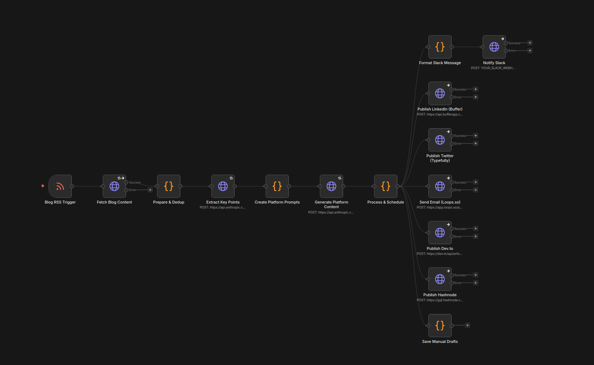

# Automated Marketing Engine

**Turn one blog post into 8 platform-specific pieces of content, automatically.**

[](https://opensource.org/licenses/MIT)
[](https://github.com/)
[](https://n8n.io)

A self-hosted content repurposing pipeline that watches your blog's RSS feed and automatically generates platform-optimized content for LinkedIn, Twitter/X, Reddit, Email, Dev.to, Hashnode, Indie Hackers, and LinkedIn Carousels — all scheduled on a 7-day drip calendar.

## Pipeline



## How It Works

```
Blog Post (RSS Feed)
        |
        v
   n8n Pipeline (self-hosted, runs every 20 min)
        |
        v
   Jina.ai (converts URL → clean text)
        |
        v
   Duplicate Check (skips already-processed posts)
        |
        v
   Claude AI — Extract Key Points (temp 0.3)
        |
        v
   Claude AI — 8 Parallel Platform Transforms
        |
        v
   7-Day Drip Schedule + UTM Links
        |
        +──→ Buffer (LinkedIn)          [auto]
        +──→ Typefully (Twitter/X)      [auto]
        +──→ Loops.so (Email)           [auto]
        +──→ Dev.to API                 [auto]
        +──→ Hashnode API               [auto]
        +──→ Reddit draft               [manual]
        +──→ Carousel outline           [manual]
        +──→ Indie Hackers draft        [manual]
        +──→ Slack notification         [review]
```

## Features

- **One blog post → 8 content pieces** — LinkedIn post, Twitter thread, Reddit discussion, email newsletter, carousel outline, Dev.to cross-post, Hashnode cross-post, Indie Hackers update
- **7-day drip schedule** — Content releases staggered across a week for maximum reach
- **UTM tracking** — Every link includes utm_source/medium/campaign/content for analytics
- **Graceful degradation** — Unconfigured platforms are skipped silently; the rest continue
- **Configurable** — One config file to customize for any niche, any brand
- **Self-hosted** — Runs on your machine via Docker. Your data stays with you
- **Comment engine included** — Local LLM-powered comment drafting for Reddit, LinkedIn, and Hacker News

## Quick Start

> **Requirements:** [Docker](https://docs.docker.com/get-docker/), [Docker Compose](https://docs.docker.com/compose/install/), and [Node.js 18+](https://nodejs.org/) must be installed before starting.

### 1. Clone and set up

```bash
git clone https://github.com/davidsly4954/Automated-Marketing-Engine.git
cd Automated-Marketing-Engine

# Option A: Automated setup (creates .env with secure keys + config.js)
./setup.sh

# Option B: Manual setup
cp config.example.js config.js
cp .env.example .env
openssl rand -hex 16    # → paste into POSTGRES_PASSWORD in .env
openssl rand -hex 16    # → paste into N8N_ENCRYPTION_KEY in .env
```

### 2. Edit your config

Open `config.js` and fill in at minimum:
- `companyName` — your company or brand name
- `rssFeedUrl` — your blog's RSS feed URL
- `nicheDescription` — one sentence about what your company does

See [config.example.js](config.example.js) for all options.

### 3. Start the services

```bash
docker compose up -d
```

Open http://localhost:5678 — you should see the n8n dashboard.

### 4. Generate and import the workflow

This reads your `config.js` and generates a customized workflow — run this **after** editing your config:

```bash
node n8n/scripts/build-workflow.js
```

In n8n: **Add workflow** → **Import from file** → select `n8n/workflows/content-repurposing-pipeline.json`

### 5. Add your Claude API key

Get a key at [console.anthropic.com](https://console.anthropic.com/), add it to `.env`, and restart:

```bash
docker compose restart
```

That's it. Write a blog post, and the engine takes care of the rest.

## Drip Schedule

| Day | Platform | Time | Method |
|-----|----------|------|--------|
| Tue | LinkedIn | 10 AM | Buffer (auto) |
| Tue | Twitter/X | 12 PM | Typefully (auto) |
| Wed | Email | 10 AM | Loops.so (auto) |
| Thu | Carousel | 10 AM | Manual (Canva) |
| Fri | Reddit #1 | 8 AM | Manual |
| Mon | Dev.to + Hashnode | 9 AM | Auto (API) |
| Tue | Reddit #2 | 9 AM | Manual |
| Wed | Indie Hackers | 10 AM | Manual |

## Cost

| Category | Cost |
|----------|------|
| Per blog post (Claude API) | ~$0.15 |
| Minimum monthly (free tools only) | $0 |
| With LinkedIn + Twitter scheduling | ~$25/mo |
| Full stack (all platforms) | ~$74/mo |

See [docs/COST-BREAKDOWN.md](docs/COST-BREAKDOWN.md) for the full breakdown.

## Customization

Edit `config.js` to adapt for your niche:

```javascript
module.exports = {
  companyName: 'YourCompany',
  blogUrl: 'https://yourdomain.com',
  rssFeedUrl: 'https://yourdomain.com/feed',
  nicheDescription: 'a SaaS helping businesses with [your value proposition]',
  redditSubreddit: 'r/your_niche',
  // ... see config.example.js for all options
};
```

Then regenerate the workflow:

```bash
node n8n/scripts/build-workflow.js
```

Re-import the JSON into n8n.

## Project Structure

```
Automated-Marketing-Engine/
├── README.md                 ← You are here
├── setup.sh                  ← One-command setup script
├── config.example.js         ← Brand/niche configuration template
├── docker-compose.yml        ← n8n + PostgreSQL containers
├── .env.example              ← API keys template
├── n8n/
│   ├── scripts/
│   │   └── build-workflow.js         ← Configurable pipeline generator
│   └── workflows/
│       └── content-repurposing-pipeline.json  ← Generated workflow
├── comment-engine/
│   ├── README.md             ← Comment engine architecture
│   ├── rules.md              ← Platform rules & ban avoidance
│   ├── discovery-setup.md    ← Discovery tool setup guides
│   └── prompts/
│       ├── reddit.txt        ← Reddit comment system prompt
│       ├── linkedin.txt      ← LinkedIn comment system prompt
│       └── hackernews.txt    ← HN comment system prompt
└── docs/
    ├── ARCHITECTURE.md       ← How the pipeline works (step-by-step)
    ├── SETUP-GUIDE.md        ← Full setup checklist
    ├── EMAIL-NURTURE-TEMPLATES.md  ← 7-email nurture sequence framework
    ├── COST-BREAKDOWN.md     ← Detailed cost analysis
    └── FUTURE-OPTIMIZATIONS.md     ← Roadmap of enhancements
```

## Documentation

| Doc | What It Covers |
|-----|---------------|
| [Architecture](docs/ARCHITECTURE.md) | How the pipeline works, what each tool does |
| [Setup Guide](docs/SETUP-GUIDE.md) | Step-by-step setup checklist |
| [Comment Engine](comment-engine/README.md) | Local LLM comment drafting workflow |
| [Platform Rules](comment-engine/rules.md) | Ban avoidance, karma building timeline |
| [Email Templates](docs/EMAIL-NURTURE-TEMPLATES.md) | 7-email post-action nurture framework |
| [Cost Breakdown](docs/COST-BREAKDOWN.md) | Per-post and monthly costs |
| [Future Optimizations](docs/FUTURE-OPTIMIZATIONS.md) | Everything not yet implemented |

## Prerequisites

- **Docker** and **Docker Compose** — for running n8n and PostgreSQL
- **Node.js 18+** — for the workflow generator script
- **A blog with an RSS feed** — the pipeline watches this for new posts
- **Anthropic API key** — for Claude Sonnet content generation (~$0.15/post)
- **GPU with 8+ GB VRAM** (optional) — for local LLM comment drafting via Ollama

## Contributing

Contributions are welcome. Some ideas:

- Additional platform support (Bluesky, Mastodon, Substack)
- Pre-publish approval flow with Slack interactive buttons
- Google Sheets integration for content tracking
- Quality scoring gate (auto-revise below 7/10)
- Image/carousel generation via Canva API
- Additional LLM provider support (OpenAI, local models)

## License

[MIT](LICENSE)
